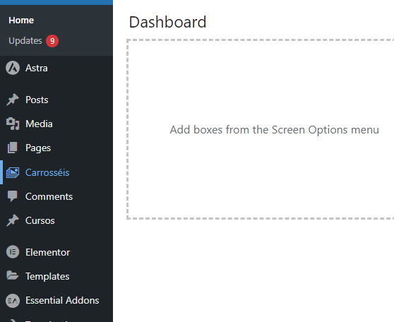
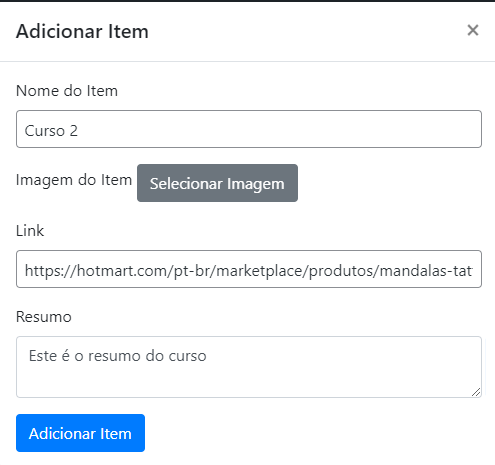
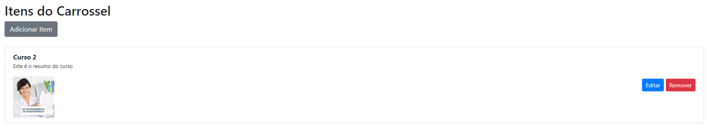

# Carossel Customizado Plugin

Este plugin permite a criação de múltiplos carrosséis utilizando Bootstrap e Owl Carousel. Ele possui uma interface visual intuitiva que permite a adição de vários carrosséis, gerando um shortcode único para cada um. Você pode incluir o shortcode diretamente no corpo do site.

## Funcionalidades

- Criação de múltiplos carrosséis.
- Interface visual para fácil adição e configuração de carrosséis.
- Utiliza Bootstrap e Owl Carousel para uma experiência responsiva e atraente.
- Gera shortcodes únicos para cada carrossel.

## Requisitos

- WordPress 5.0 ou superior
- Bootstrap 4.0 ou superior
- Owl Carousel 2.0 ou superior

## Instalação

1. Baixe o plugin.
3. No painel administrativo do WordPress, vá para `Plugins`, adicione e ative o `Carossel Customizado`.

## Uso

### Adicionando um novo carrossel

1. No painel administrativo do WordPress, vá para `Carrosséis` escolha o nome do seu novo carrossel e clique em `Adicionar Carrossel`.
    
 

3. Selecione `editar` no carrossel criado, em seguida selecione `adicionar item`:
 
 
    - Adicione as imagens, titulo, descrição e link de destino do conteúdo desejado.
4. Salve o carrossel.
 
5. Um shortcode único será gerado para o carrossel na página inicial. Copie este shortcode.

### Inserindo o carrossel no site

1. Vá para a página ou post onde deseja adicionar o carrossel.
2. Cole o shortcode gerado no local desejado.
3. Atualize a página ou post.
